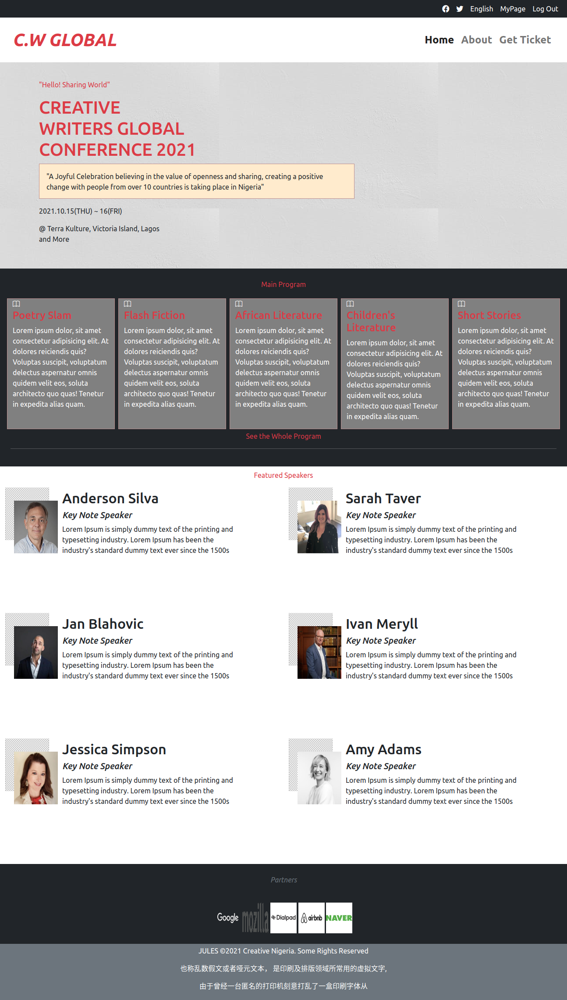

Capstone Project: Creative Writers Global Conference Page

> Capstone project that entails building a conference page taking into consideration the Client's Business requirements.

## Built With

- Major languages
  HTML & CSS

- Frameworks
  BOOTSTRAP 5

- Technologies used
  VISUAL STUDIO CODE

## Live Demo

[Live Demo Link](https://julianaosemeke.github.io/ConferencePage/)

## Author

👤 **Juliana Osemeke**

- GitHub: [@JulianaOsemeke](https://github.com/JulianaOsemeke)
- Twitter: [@JulianaOsemeke](https://twitter.com/JulianaOsemeke)
- LinkedIn: [@julianaosemeke](https://ng.linkedin.com/in/juliana-osemeke)

## 🤝 Contributing

Contributions, issues, and feature requests are welcome!

Feel free to check the [issues page](issues/).

## Show your support

Give a ⭐️ if you like this project!

## 📝 License

This project is [MIT](lic.url) licensed.
