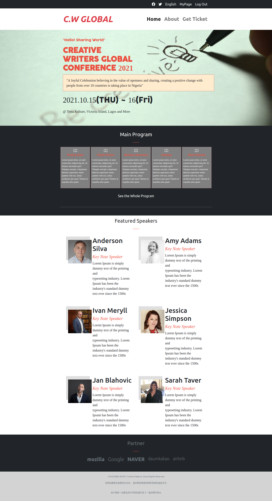

Capstone Project: Creative Writers Global Conference Page

> Capstone project that entails building a conference page taking into consideration the Client's Business requirements.

## Built With

- Major languages
  HTML & CSS

- Frameworks
  BOOTSTRAP 5

- Technologies used
  VISUAL STUDIO CODE

## Live Demo

[Live Demo Link](https://julianaosemeke.github.io/ConferencePage/)

#Getting Started
This is an example of how you may give instructions on setting up your project locally. Modify this file to match your project, remove sections that don't apply. For example: delete the testing section if the currect project doesn't require testing.

## Usage
To get a local copy up and running follow these simple example steps.
1. Clone the master repository on your system locally by running this command : git clone git@github.com:JulianaOsemeke/ConferencePage.git

2. Deploy on github page

## Author

👤 **Juliana Osemeke**

- GitHub: [@JulianaOsemeke](https://github.com/JulianaOsemeke)
- Twitter: [@JulianaOsemeke](https://twitter.com/JulianaOsemeke)
- LinkedIn: [@julianaosemeke](https://ng.linkedin.com/in/juliana-osemeke)

## 🤝 Contributing

Contributions, issues, and feature requests are welcome!

Feel free to check the [issues page](issues/).

## Show your support

Give a ⭐️ if you like this project!

## 📝 License

This project is [MIT](lic.url) licensed.
